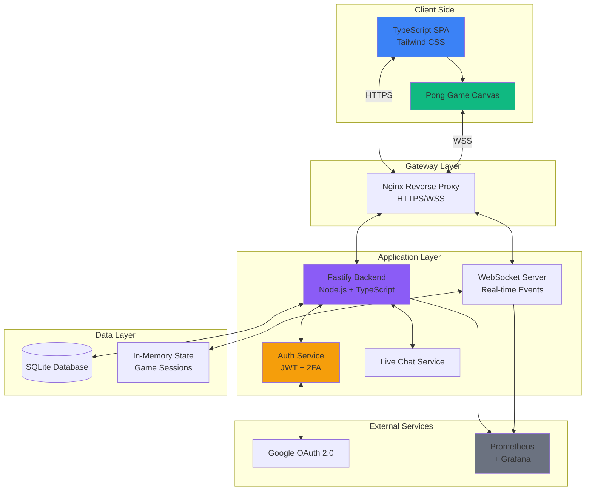
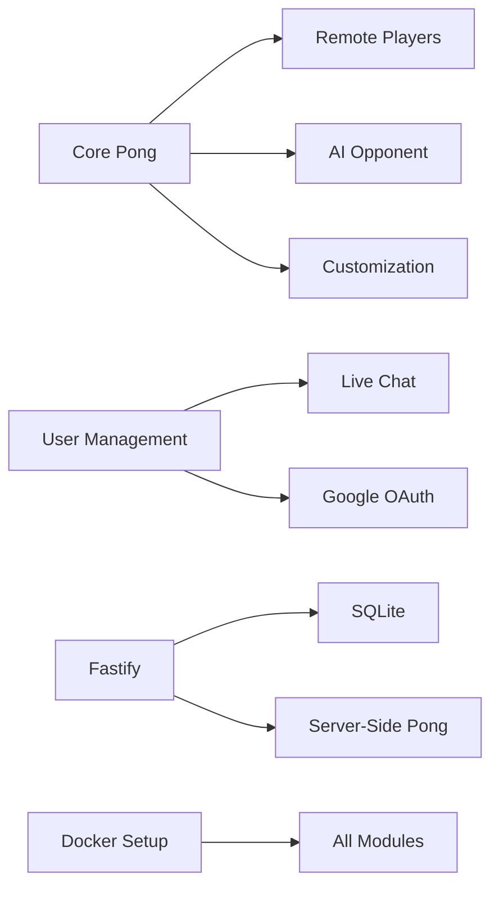

# 🏓 ft_transcendence

A real-time multiplayer Pong game web application built as part of the 42 School curriculum.

## 📋 Project Overview

ft_transcendence is a full-stack web application featuring:
- Classic Pong gameplay with modern enhancements
- Real-time multiplayer capabilities
- Tournament system with bracket generation
- User authentication and profiles
- Live chat functionality
- AI opponents

**Total Points:** 115/100 (7 Major + 3 Minor modules)

## 👥 Team Structure & Responsibilities

| Role | Team Member | Modules |
|------|-------------|---------|
| **Frontend Developer** | Alec | Core Pong + Tailwind UI + Game Customization |
| **Backend Developer** | Moritz | Fastify Framework + SQLite Database + Live Chat  |
| **Realtime/AI Developer** | Olena | Remote Players + AI Opponent + Server-Side Pong |
| **Security/Auth Developer** | Elmira | User Management + Google OAuth (10pts) + 2FA & JWT |
| **DevOps Engineer** | Görkem | Docker Setup + HTTPS/WSS + Monitoring with Prometheus/Grafana |

## 🏗️ System Architecture



## 🚀 Quick Start

### For Development (Local Machine)
```bash
# Clone the repository
git clone https://github.com/korberlin/ft_transcendence.git
cd ft_transcendence

# Setup environment variables
cp .env.example .env
cp auth-service/.env.example auth-service/.env
# Edit .env files with your credentials

# Generate SSL certificates and start services
make dev

# Access the application at https://localhost:443
```

### For Production/Evaluation (42 Campus)
```bash
# Clone the repository
git clone https://github.com/korberlin/ft_transcendence.git
cd ft_transcendence

# Setup environment variables
cp .env.example .env
cp auth-service/.env.example auth-service/.env
# Edit .env files with your credentials

# Generate SSL certificates
./scripts/generate-ssl.sh

# Start all services (campus-safe, no bind-mounts)
make all

# Access the application at https://localhost:443
```

### Docker Deployment Modes

**Development Mode (`make dev`):**
- Uses `docker-compose.yml`
- Employs bind-mount volumes for hot-reload
- Fast development iteration
- **Not campus-safe** (requires root Docker access)

**Production Mode (`make all`):**
- Uses `docker-compose.prod.yml`
- Uses named Docker volumes (campus-safe)
- Compatible with rootless Docker environments
- **Recommended for evaluation**

> ℹ️ **Why two modes?** Campus computers run Docker in rootless mode for security. Bind-mounts (direct host directory mounting) can fail due to UID/permission mismatches. Named volumes are Docker-managed and work in both environments.

## 📁 Project Structure

```
ft_transcendence/
├── frontend/          # TypeScript SPA + Game Engine
├── backend/           # Fastify API Server
├── realtime/          # WebSocket Server
├── auth/              # Authentication Service
├── docker/            # Docker Configurations
├── docs/              # Documentation
└── docker-compose.yml # Orchestration
```

## 🔄 Development Workflow

### Branch Naming
- `feature/[epic]-[description]` - New features
- `fix/[issue-number]-[description]` - Bug fixes
- `chore/[description]` - Maintenance tasks

### Commit Convention
```
[EPIC] Brief description

- Detailed change 1
- Detailed change 2

Issue: #XX
```

## 📅 Current Sprint: Week 1-2 (Foundation)

### Sprint Goals
Establish the foundational architecture and core functionality for the project.

### Sprint Tasks

**DevOps:**
- [ ] #7 Setup Docker development environment
- [ ] #13 Configure HTTPS and WSS

**Frontend:**
- [ ] #8 Initialize TypeScript SPA project
- [ ] #10 Implement basic Pong game mechanics
- [ ] #15 Create basic UI layout

**Backend:**
- [ ] #9 Initialize backend project structure
- [ ] #12 Setup database with SQLite
- [ ] #16 Implement Fastify framework

**Security:**
- [ ] #11 Design authentication architecture

**Realtime:**
- [ ] #14 Research WebSocket implementation

## 🛠️ Tech Stack

- **Frontend:** TypeScript, Tailwind CSS, Canvas API
- **Backend:** Node.js, Fastify, TypeScript
- **Database:** SQLite
- **Real-time:** WebSocket (ws)
- **Auth:** JWT, Google OAuth 2.0, TOTP
- **DevOps:** Docker, Nginx, Prometheus, Grafana
- **Security:** HTTPS/WSS, Rate Limiting, Input Validation

## 📊 Module Dependencies



## 🔐 Security Requirements

- ✅ All passwords hashed (bcrypt)
- ✅ HTTPS/WSS for all connections
- ✅ Protection against SQL injection & XSS
- ✅ JWT token authentication
- ✅ Rate limiting on API endpoints
- ✅ Input validation & sanitization

## 📝 Notes

- Single-page application with browser history support
- Compatible with latest Mozilla Firefox
- No unhandled errors or warnings
- Single command deployment via Docker

---

```
